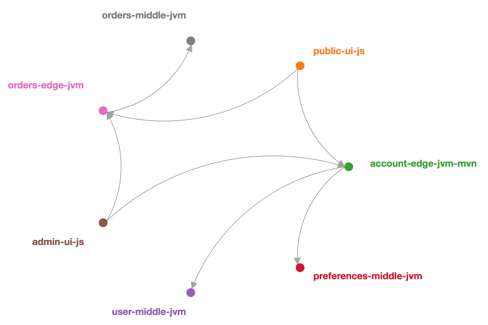

# lawyerly-sandbox

Ecosystem of Services for messing around with Consumer-Driven Contracts (CDC), Contract Testing and Pact. Architecture is 3 Middle Tier, 2 Edge Tier and 2 Frontend/UI Tier Services, but the point is just to cover the spectrum of Pure Consumers (UI), Pure Providers (Middle) and Services that are both a Consumer and a Provider (Edge; Consumer of Middle and Provider to UI).



## Setup

### Environment

```bash
git clone [your fork]
cd lawyerly-sandbox/
export LAWYERLY_SANDBOX=$(pwd)
```

### Pact Broker

The Pact Broker runs continuously as a service on localhost. For this example, we'll deploy it locally in a Docker container (so make sure Docker is installed and running).

```bash
cd $LAWYERLY_SANDBOX/broker/
docker-compose build # Build only needed on first setup
docker-compose up -d # -d for detached mode to keep broker running after closing terminal
```

You can now access the Broker [locally](http://localhost). At first it will be empty of contracts, so let's go ahead and populate it.

### Contracts

This script just iterates through the projects, building and publishing contracts to the broker. You can of course do this manually!

```bash
cd $LAWYERLY_SANDBOX/
./setup.sh
```

The broker should now list all the contracts.

## Create and Publish Pacts to Pact Broker

### Build JVM Consumer and Publish Pact to Pact Broker

JVM Consumers implement PactFragment classes to specify the expectation they have for services they rely on. Building will create these 'mocks' and running a publish task will publish them to the Pact Broker. It is up to each consumer to update the Pact Broker with any expectations they have for services and to update the broker with changes to the pacts. This allows services to reach out to the broker and verify they continue to meet the pacts they have against them.

#### Gradle

```bash
cd $LAWYERLY_SANDBOX/orders-edge-jvm/
# Build Service and Generate Contracts within `build/pacts/` directory
./gradlew clean build
# Publish Contracts to Pact Broker
./gradlew pactPublish
```

#### Maven

```bash
cd $LAWYERLY_SANDBOX/account-edge-jvm-mvn/
# Build Service and Generate Contracts within `target/pacts/` directory
./mvnw clean install
# Publish Contracts to Pact Broker
./mvnw pact:publish
```

### Build NodeJS Consumer and Publish Pact to Pact Broker

```bash
cd $LAWYERLY_SANDBOX/public-ui-js/
npm install
# Generate Contract JSON files within `pacts/` directory
npm run test:pact:consumer
# Publish Contracts to Pact Broker
npm run test:pact:publish
```

## Developing a Service that is an Endpoint Provider to Consumers

### Run Provider

The service being developed/tested must be running for the pacts to be verified. It is configured to run on port 8080. This service has the SpringBoot DevTools package included which enables the service to be reloaded when changes are made to the source during development.

#### Gradle

```bash
cd $LAWYERLY_SANDBOX/user-middle-jvm/
# Build Service
./gradlew clean build
# Start Service
./gradlew bootRun
```

#### Maven

```bash
cd $LAWYERLY_SANDBOX/account-edge-jvm-mvn/
# Build Service
./mvnw install
# Start Service
./mvnw spring-boot:run
```

### Verify Pacts from Pact Broker with Running Service

As changes are made, run pact verify to have the service reach out to the Pact Broker to receive all the consumer pacts and verify the pacts are still being met.

#### Gradle

```bash
cd $LAWYERLY_SANDBOX/user-middle-jvm/
# Call out to Pact Broker for all Contracts where is Provider and then Test against them
./gradlew pactVerify
```

#### Maven

NOTE: Currently `account-edge-jvm-mvn` requires the backing middle services to be running for the calls to work.

```bash
cd $LAWYERLY_SANDBOX/account-edge-jvm-mvn/
# Call out to Pact Broker for all Contracts where is Provider and then Test against them
./mvnw pact:verify
```

## Pact Broker Usage

### Deleting 'Pacticipants' and by extension, contracts

```bash
curl -X DELETE http://localhost/pacticipants/user-middle-jvm
```

### HAL Browser

The Broker is implemented using HAL which provides a robust REST interface for querying. Explore the [HAL Browser](http://localhost/hal-browser/browser.html#/).
